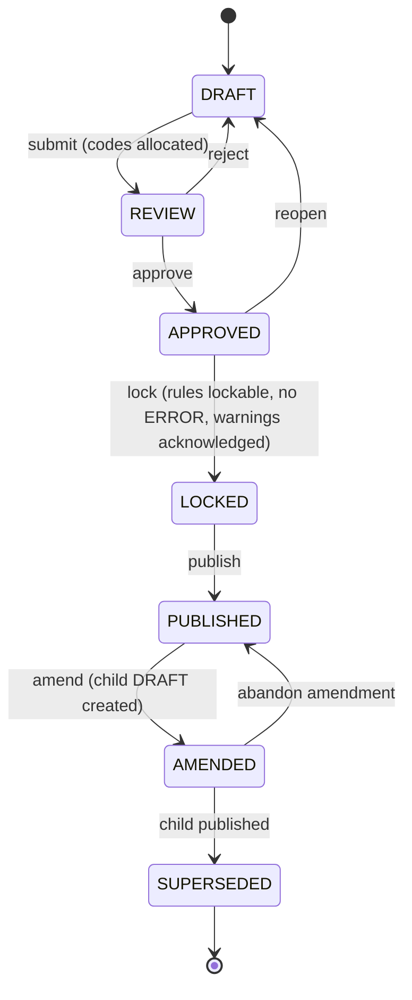
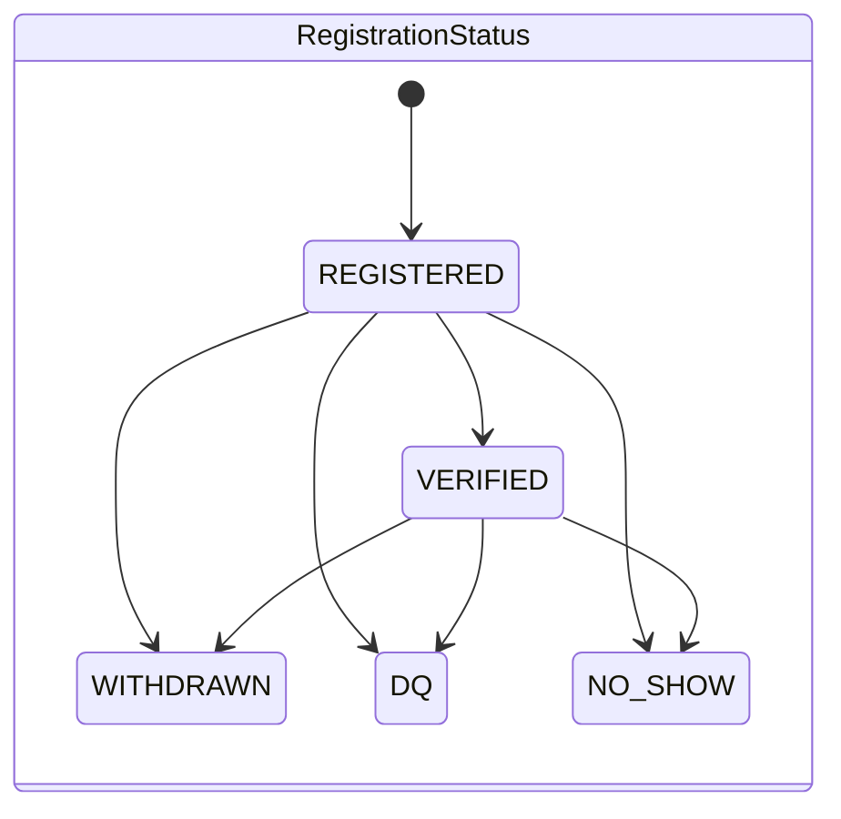

# Domain Model

Source of truth: `packages/domain` (types, state machines), `packages/rules` (rule-set model),
`packages/db/src/schema` (tables). This document is the map; the code is the territory.

## 1. Core distinction: person, entry, competition unit

```
Athlete (person in one tournament) ──< EntryMember >── Entry (one competition entry)
                                                          │  1 athlete  → Kyorugi / Poomsae individual
                                                          │  2 athletes → Poomsae pair (1F + 1M)
                                                          │  3 athletes → Poomsae team (one gender)
                                                          ▼
                                   Category ──< Pool ──1 Bracket ──< Slot / Match
```

A pair or team is **one** entry. It enters one bracket slot, never two.

## 2. Entity–relationship diagram

```mermaid
erDiagram
  TOURNAMENT ||--o{ TOURNAMENT_MEMBER : grants
  APP_USER ||--o{ TOURNAMENT_MEMBER : holds
  TOURNAMENT ||--o{ RULE_SET : versions

  RULE_SET ||--o{ RULE_AGE_DIVISION : defines
  RULE_SET ||--o{ RULE_BELT : defines
  RULE_SET ||--o{ RULE_BELT_BAND_SCHEME : defines
  RULE_BELT_BAND_SCHEME ||--o{ RULE_BELT_BAND : contains
  RULE_BELT_BAND ||--o{ RULE_BELT_BAND_MEMBER : "belts in band"
  RULE_BELT ||--o{ RULE_BELT_BAND_MEMBER : member
  RULE_SET ||--o{ RULE_MOVEMENT_MAP : defines
  RULE_MOVEMENT_MAP ||--o{ RULE_MOVEMENT_MAP_ENTRY : "band -> movement"
  RULE_SET ||--o{ RULE_WEIGHT_CLASS_TABLE : defines
  RULE_WEIGHT_CLASS_TABLE ||--o{ RULE_WEIGHT_CLASS : contains
  RULE_SET ||--o{ RULE_POOL_POLICY : defines
  RULE_POOL_POLICY ||--o{ RULE_TOLERANCE : "ideal / max"
  RULE_POOL_POLICY ||--o{ RULE_POOL_SIZE_PENALTY : scores
  RULE_SET ||--o{ RULE_CATEGORY_TEMPLATE : defines
  RULE_CATEGORY_TEMPLATE }o--o| RULE_POOL_POLICY : "pooled formats"

  TOURNAMENT ||--o{ CONTINGENT : registers
  TOURNAMENT ||--o{ IMPORT_BATCH : receives
  IMPORT_BATCH ||--o{ IMPORT_ROW : "raw, immutable"
  TOURNAMENT ||--o{ ATHLETE : "persons (scoped)"
  ATHLETE ||--o{ WEIGH_IN_RECORD : "verified values"
  ATHLETE ||--o{ MEASUREMENT_CORRECTION : "original + corrected"
  CONTINGENT ||--o{ ENTRY : "per entry, not per person"
  ENTRY ||--|{ ENTRY_MEMBER : has
  ATHLETE ||--o{ ENTRY_MEMBER : plays
  ENTRY ||--o| ENTRY_GROUP : "pair/team provenance"
  ENTRY }o--o| CATEGORY : "assigned"
  VALIDATION_ISSUE ||--o{ DATA_QUALITY_OVERRIDE : "TD only"

  RULE_SET ||--o{ CATEGORY : partitions
  TOURNAMENT ||--o{ DRAW_RUN : requests
  DRAW_RUN ||--o{ DRAW_RUN_CATEGORY : "READY / BLOCKED"
  DRAW_RUN_CATEGORY ||--o{ POOL_CANDIDATE : "5 strategies kept"
  DRAW_RUN ||--o{ DRAW_REVISION : "lineage"
  DRAW_REVISION ||--o{ POOL : "copy-on-write"
  POOL ||--|{ POOL_MEMBER : contains
  ENTRY ||--o{ POOL_MEMBER : "once per revision"
  POOL ||--|| BRACKET : has
  BRACKET ||--|{ BRACKET_SLOT : "2^k slots"
  BRACKET ||--|{ MATCH : "n-1 real matches"
  MATCH }o--o| MATCH_CODE_REGISTRY : "public code"
  CATEGORY ||--o| OFFICIAL_CATEGORY_ASSIGNMENT : "one official revision"
  DRAW_REVISION ||--o{ QUALITY_REPORT : evaluates
  DRAW_REVISION ||--o{ WARNING_ACKNOWLEDGEMENT : "before LOCK"

  DRAW_REVISION ||--o{ DRAW_COMMAND : "append-only"
  COMPLAINT }o--o| DRAW_COMMAND : "resolved by"
  TOURNAMENT ||--o{ AUDIT_EVENT : "hash chain"
```



49 tables in total (`packages/db/migrations/0000_core_schema.sql`); the diagram omits identity
columns and some rule-set leaves.

## 3. State machines

### Draw revision (ADR-0004)



Content is editable only in `DRAFT`. `PUBLISHED` and `AMENDED` are official.

### Entry: two independent statuses (ADR-0011)



`EligibilityStatus` is **derived**, not a workflow:

| Condition (first match wins)                                      | Eligibility |
| ----------------------------------------------------------------- | ----------- |
| Registration is WITHDRAWN / DQ / NO_SHOW                          | BLOCKED     |
| Open ERROR without override, rule gap, or unconfirmed entry group | BLOCKED     |
| Placed in a LOCKED or PUBLISHED revision                          | DRAWN       |
| At least one ERROR covered by an active TD override               | OVERRIDDEN  |
| Otherwise                                                         | READY       |

### Complaint

`OPEN → UNDER_REVIEW → ACCEPTED → RESOLVED`, `OPEN/UNDER_REVIEW → REJECTED`. ACCEPTED and
RESOLVED must reference the resulting command or revision.

### Draw run

`QUEUED → RUNNING → SAFE | UNSAFE | FAILED` (and `QUEUED → FAILED`). Immutable once finished. A
`SAFE` candidate requires a matching dual run.

## 4. Rule-set model (ADR-0007/0008/0009)

| Part               | Content                                                                                                                                                                                    |
| ------------------ | ------------------------------------------------------------------------------------------------------------------------------------------------------------------------------------------ |
| Age                | policy `BIRTH_YEAR` / `AGE_ON_EVENT_DATE` / `AGE_ON_CUTOFF_DATE` / `CUSTOM`; divisions with birth-year bands, streams, play-up policy                                                      |
| Belts              | code, rank, exact source labels; band schemes (MOVEMENT / COMPATIBILITY)                                                                                                                   |
| Movement map       | band → Taegeuk (2026: 9–8 → T1, 7–6 → T3, 5–4 → T5, 3 → T6)                                                                                                                                |
| Weight classes     | per stream × division × gender, bounds in grams, completeness `OFFICIAL` / `OBSERVED_SUBSET`                                                                                               |
| Category templates | stream × discipline × format → partition dimensions, gender mode (`BY_ENTRY` / `MIXED`), draw format, bye policy, bronzes                                                                  |
| Pool policy        | min/target/max size, size penalties, belt policy HARD/SOFT/DISABLED, tolerances (ideal + max UNSET/NONE/SET), tier weights and slack, singleton policy, measurement source, contingent key |
| Provenance         | every decision: COMMITTEE / STAKEHOLDER / EVIDENCE_2026 / ENGINEERING_DEFAULT / TBD                                                                                                        |

Readiness per purpose: `SIMULATION` and `CANDIDATE` need a structurally valid rule set; `LOCK`
additionally needs every active maximum decided, no `TBD`, an `ACTIVE` rule set, and
acknowledgement of warnings (non-committee values, observed-subset weight tables).

## 5. Aggregate boundaries (for Phase 4 commands)

| Aggregate        | Root               | Consistency boundary                                                                         |
| ---------------- | ------------------ | -------------------------------------------------------------------------------------------- |
| Rule set         | `rule_set`         | edited as DRAFT; frozen on activation                                                        |
| Participant data | `athlete`, `entry` | import batch transaction; corrections one record at a time                                   |
| Draw run         | `draw_run`         | written once by the worker                                                                   |
| Revision         | `draw_revision`    | one command = one transaction = new state + command + audit event; guarded by `lock_version` |
| Complaint        | `complaint`        | status transitions; resolution references a command/revision                                 |
